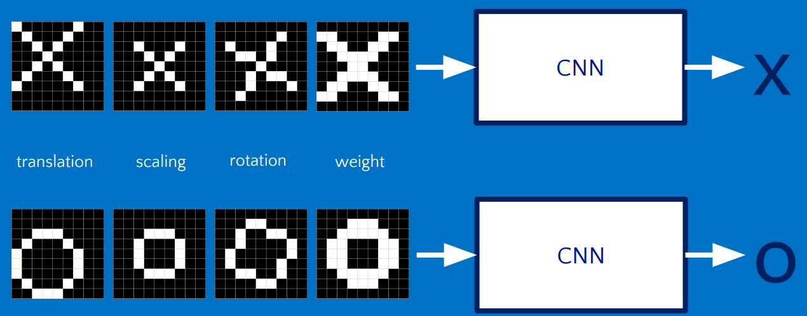

## 一步一步 CNN

[TOC]

$\textcolor{red}{目标}$  <u>如何识别手写的英文字母？  再简单一点点：比如给一个"X"的图案，计算机如何识别这个图案就是"X"?</u>

如上图所示，CNN就是要告诉我们输入的是X还是O。下面带着这个目标，一步一步的推导一下CNN。

在识别过程中，还存在一个问题：图片畸形。图片或多或少会存在畸形，CNN也要能够正确的识别，这才能满足需求，因为在现实中，图片畸形是广泛存在的。

#### 什么是卷积

数学上对卷积的定义：
$$
连续卷积：  (f*g)(n)= \int_{-∞}^{+∞} f(τ)g(n-τ)
$$

$$
离散卷积：  (f*g)(n)= \sum_{τ=-∞}^{∞} f(τ)g(n-τ)
$$

当看这两个公式很抽象，我们来举一些更加形象的例子。

例如：我们有两枚骰子，同时仍出去，现在我们要计算两枚骰子点数加起来为4的概率是多少？

出现总和为4的概率的几种情况有： f(1)g(3),f(2)g(2),f(3)g(1)。可以用如下的卷积公式表示（离散卷积）：
$$
(f*g)(4)=\sum_{m=1}^{3}f(4-m)g(m)
$$
看着这些公式表示懵逼~~~~用图像处理中的思路来解释，看下面的gif动画，我们可以认为f(x)就是原始的图像，g(m)就是那个小的矩阵（可以认为是各种滤波器），卷积操作，就是用小的矩阵g(m)依次与原矩阵f(x)做内积（相乘再相加），然后用内积替换原图像f(x)总相应位置的值。

图像卷积的例子：

在CNN中，卷积指啥意思呢？ 拿上面的图片识别的例子，卷积就是未知图案的局部和标准图片的局部一个一个比对时的计算过程，卷积计算结果为1表示匹配，否则不匹配。 说的太笼统了~~能有更加具体一点的吗？ 在CNN中卷积操作到底指啥呢？ 前面图像的例子也说了，卷积是原图像与另外一个矩阵的内积，那么在CNN中，卷积也是内积，是什么的内积呢？其实CNN的卷积操作，就是神经元与输入的内积。继续回顾一下神经元的组成（下图），$x1,x2,x3$ 都是输入，在每一次数据上都有一个固定的权重（w）以及偏置，因此我们可以类比图像的卷积：固定的权重就是小的矩阵，输入就是原始图像，那么在CNN中卷积就是输入经过神经元的处理得到的输出这个一个过程。

再来一个更形象的例子： input Volume表示输入， Filter w0是第一次卷积层神经元的权重，Filter  w1是第二层卷积层神经元的权重。

这里有必要解释一下卷积内积是怎么计算的？回忆一下向量的内积：$x(x1,x2,x3)$*$y(y1,y2,y3)$ =$x1y1+x2y2+x3y3$，也就是向量的各分量相乘再相加。矩阵，可以想象层高维的向量，那么矩阵的内积也可以类比到向量的内积：**各对应位置的分量相乘相加，然后再除以矩阵的总元素个数**。 这就是CNN的核心计算逻辑--矩阵对应位置相乘相加除以元素个数，没有什么高深的。计算的CNN内积放置的位置，是原始图像的矩阵的中心位置。下面图解释了CNN的计算过程：

#### RULE 激励函数

在CNN中RULE激活函数其实叫做 修正线性单元，做的事情也很简单：对于计算结果为正数的保留，对于计算结果为负数的，将其值设置为0.

#### 池化 POOLING

池化，简言之，即取区域平均或最大：

####全连接层

全连接层是CNN的最后一层了，经过这一层的处理，就能得到最终的结果。

上面的图很简单的解释了全连接层是如何构造的，当然实际上可能跟上面并不是很像，简单起见还是就上图那样的吧。 全连接把最终卷积的结果线性排列。

得到这个排列后，我们这么得到我们最终的结果呢？比如说：图案是X吗？ 这里有一个很大的前提就是：CNN分为训练过程和验证过程，在训练阶段，我们是知道图案到底是不是X。因此，简单的说，全连接层的线性排列实际上就代表了一个训练结果，在验证阶段，如果图案的全连接与训练的全连接层类似，可以认为是X图案。

在实际中，我们不可能比较全连接层的线性排列，而是把全连接层也看着一个卷积层，这是这个卷积层有点特殊：是1*n的卷积核，n表示全连接层线性排列的元素个数。我们用卷积来表示全连接层的输出：
$$
y=W*x +b \\
p=sigmoid(y) \\
Loss = 
$$
$x$就是全连接层的排列，$W$就是卷积核（$1*n$），$b$偏置，$y$输出值。经过sigmod函数处理，把$y$值归一化。此时的$y$值就作为训练的结果了。为了保证训练的模型更加精确，我们要保证$y$的值是最优的，因此还衍生出最后一步：优化。这里的优化就是计算Loss损失函数的最小值，反推W和b的最优值。在计算最优值的过程中，用的的数学方法就是梯度下降法~~到这里，是不是很明白了，之前看了很多地方在全连接层都说梯度下降，但是没有说明怎么用。

本文内容整理自网络，同时加入一些自己的理解，如有错误欢迎指出。

#### reference

如何通俗易懂地解释卷积      https://www.zhihu.com/question/22298352；

通俗理解卷积神经网络         https://blog.csdn.net/v_july_v/article/details/51812459

